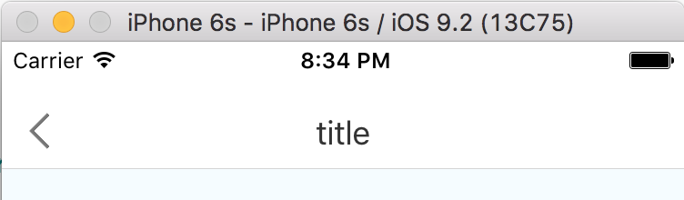
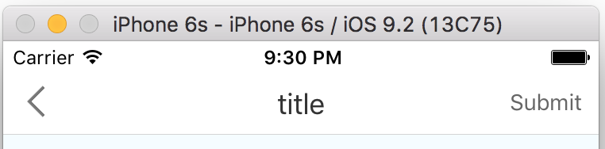

rn-navbar
---
[![NPM version][npm-image]][npm-url]
[![npm download][download-image]][download-url]

[npm-image]: http://img.shields.io/npm/v/rn-navbar.svg?style=flat-square
[npm-url]: http://npmjs.org/package/rn-navbar
[download-image]: https://img.shields.io/npm/dm/rn-navbar.svg?style=flat-square
[download-url]: https://npmjs.org/package/rn-navbar

A NavBar component for react-native.

## Install

```
npm i rn-navbar --save
```

## Usage

```js
var React = require('react-native');
var NavBar = require('rn-navbar');

module.exports = React.createClass({
  render () {
    return (<NavBar title="RNComponents" backFunc={()=>{this.props.navigator.pop()}} />);
  }
});
```

## Props

 Name | Description | Default  | Note
------|-------------|----------|-----------
title | navbar title  | title   |
backFunc  | back function | `()=>{console.log('press back'); }` |
tintColor | color of the button of the navbar | `#777` |
titleTextColor | title color of the navbar | `#333` |
barTintColor | background color of the navbar | `white` |
actionName | right action text | |
actionFunc | right action function | |
actionTextColor | color of action text | `#666` |
backIconHidden | hide the backIcon or not | `false` |
statusbarPadding | add a padding for statusbar or not | `true` |

## Example

[RNNavbar](./example/RNNavbar)

## Screenshot

- Default NavBar



- With Action button



## License

The MIT License
